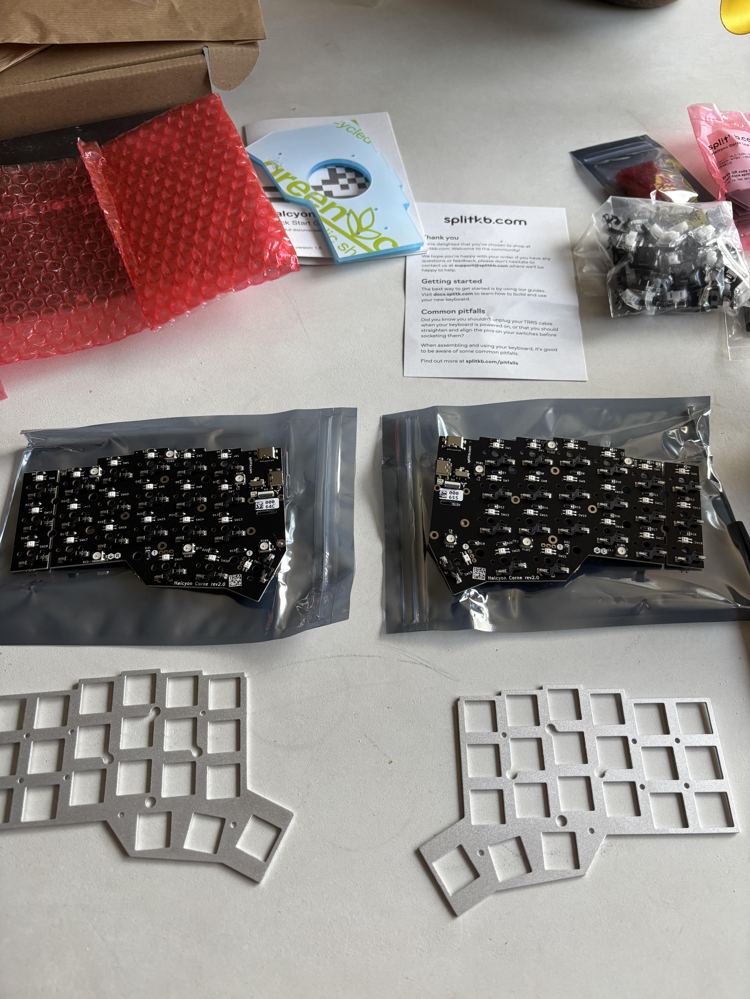
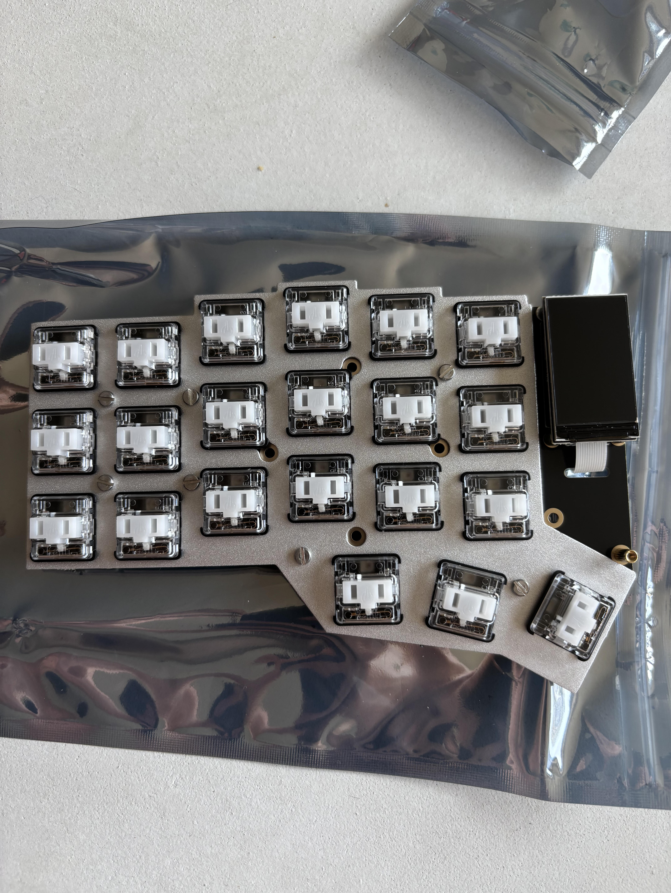
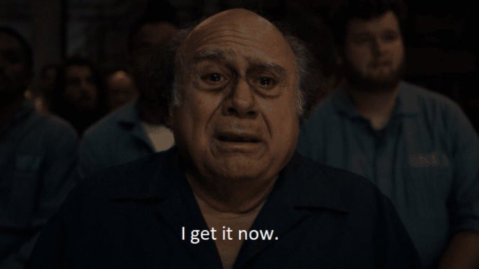

+++
date = '2025-08-12T16:18:31+01:00'
draft = false
title = 'Monkey Brain: I Built My First Keyboard'
summary = 'The curse of being a software engineering hipster continues to grip my life'
tags = ['Personal', 'Project', 'Hobby', 'Keyboard', 'Hardware']
+++

# I Like Being a Cool Typist
From a quick check through my email, I ordered my first split keyboard (the [Ergodox
EZ](https://ergodox-ez.com/)) on June 20th of last year. I had been borrowing a
then-coworker-now-friend's old one for a couple of months before that, which had served as
my introduction to the world of people saying "whoah, your keyboard is weird." At this
point, that former-coworker-now-friend (you know who you are) receives a text from me
approximately once every 3 months that simply reads "you did this to me" and includes a
picture of whatever new rabbit hole I've gone down on the world of split keyboards
("keebs" as the cool insufferable people call them).

My collection now includes 3:
* The original EZ, which was my desktop keyboard of choice for this past year
* A [ZSA Voyager](https://www.zsa.io/voyager), which functions as my work keyboard because
  it's much easier to transport
* The one I'm going to talk about building in this post!

Now, that's really not that many. I know people who have many dozens (maybe even hundreds)
of keyboards, split and not - I just have the measly 3 plus one normal plank for
emergencies. But that also doesn't include the amount of random accoutrement that I've
picked up: I've replaced the switches in the Voyager twice now (once to lizard-brain
satisfying white switches, and once to ambient silents after my coworkers took issue with
my lizard brain). I've purchased a variety of connector cables to try and find the perfect
desk setup, plus a couple different wrist wrest options. It was only a matter of time
until I dove into just building my own. And that time is last weekend (as of when I'm
writing this).

# Corney
For this, I went with a [Halcyon Corne](https://splitkb.com/products/halcyon-corne) build
from `splitkb.com`, a Dutch company run by basically one guy that have fast shipping,
fantastic quality stuff, and give you a mini stroopwafel in every box. I really like the
layout of the Voyager - the one big thumb key and the lower profile of Kailh Choc switches
just felt a lot more comfortable. I'd noticed over the course of the last couple of months
that my pinky was starting to get stretched out too much when I'd hit the control key on
my ergodox, and it also just ate up so much space on my desk. And it also didn't have
flashing lights, which is of course the most important quality. So the triple thumb
cluster of the Corne, plus the 3-row layout, was pretty much everything I was looking for.

Since I already had the aforementioned white switches (*click click click*), I only had to
order... *checks notes* the entire rest of the keyboard. Luckily splitkb has a really neat
"composer" tool that walks you through the whole process and lets you choose all your
shinies, which made it really easy. So with my bank account a couple hundred euros
lighter, I set about waiting for my free mini cookie with included assorted keyboard
parts.


I realize that this sounds like free marketing for splitkb.com... and that's exactly what
it is! It's a great, local (for me) company with well priced, good quality stuff. If
you're getting into the world of split keyboards, you could do significantly worse. I
think it's important in the digital age of shitty scam products to call out people that
are doing it right, and splitkb is one of those.


With my new Nerd Shit :tm: ready to go, I made some coffee and set out to spend my
Saturday morning doing what normal people do: building niche electronics.
 
# Everything is Legos
As it turns out, unless you're doing a super complex custom build with a custom printed
PCB and all that jazz (spoiler: that blog post is 100% coming next year), all of this
stuff is just like building a PC: seems complicated, mostly ends up being snapping things
together and putting in a few screws. AKA, Legos with electronics. So here are some
pictures of the build process!

 desk. The
[mat](https://www.fangamer.eu/collections/hades/products/hades-game-desk-mat) is from Hades.
Have I mentioned on my blog enough that I fucking love Hades yet?")

# How It's Been Going
I've been using this keyboard for a few days now, and I have a few general thoughts:
* Low profile switches are just so much better. I don't think I'm actually typing any
faster, but I *feel* like I am.
* Part of this is also the RGB setting I have turned on, where the lights splash outwards
  from where I hit, which makes it look like I'm really hammering when I'm not. But it
does make me feel cool.
* I'm not sold on the third thumb key yet. I liked it in theory, but in practice it makes
  my thumb (especially my left thumb) hurt a bit because I have to stretch it under my
palm a smidge to hit the furthest left thumb key. Maybe my hands are just big, or I need to
tent my board a bit or get some wrist wrests.
* I really want to put something more interesting on the screen, like a little gif or a
picture. Just something other that the layer indicator it has now. From some tinkering
though, I'd have to do some custom firmware compiling for that, which is fine, but that's
another whole weekend project so it may wait for a bit.
* I 100% am sold on the three-row layout. Every single non-thumb key is only one step away
  from my home row, and it feels amazing.
* I also love the much smaller form factor. This was one of my biggest gripes with the
ergodox: it just ate up so much desk space. Now I can very easily keep a notebook/bowl of
food/whatever in the center of my desk without any problems.

So all in all, successful rabbit hole. And it will only go deeper, I'm sure. I fully
recommend trying out a split keyboard if you never have - it's one of those things that
*sounds* super trendy and dumb, until you try it. And then (at least if you're like me),
you do a DeVito:

