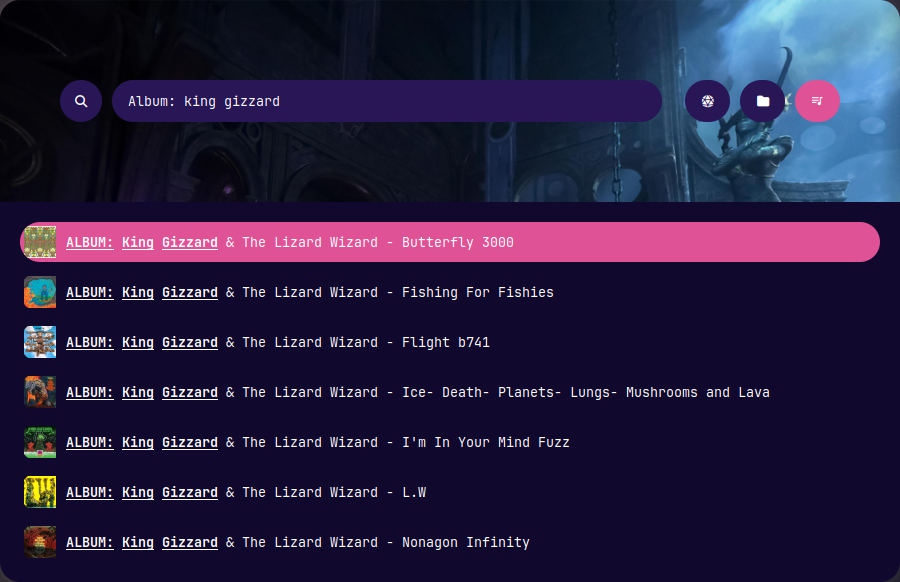
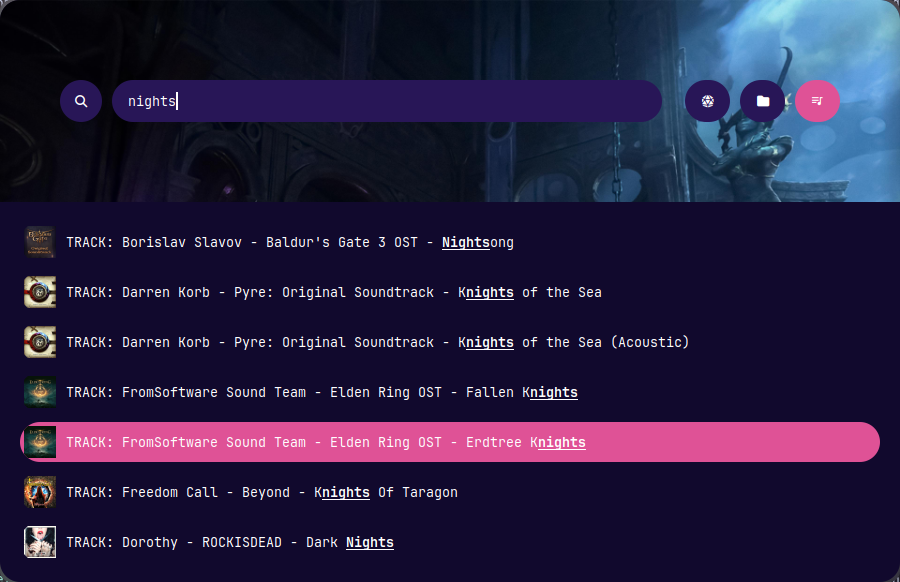

+++
date = '2025-05-30T22:48:53+02:00'
draft = false
title = 'Reinventing the Wheel: A Music Indexer and Picker'
summary = 'I made a thing that only I will use and I love it.'
tags = ['Software Engineering', 'Code', ' Personal', 'Project']
+++


This post is a thinly-veiled love letter to two things: home cooked, "it just needs to work for me"
software, and FOSS projects that provide endless amounts of tinkering, usefulness, and just straight
up ***fun*** completely for free.


---
## I'm a Gremlin Man
My last post was about how I've [become a music hoarding gremlin](https://purpleshirt.dev/posts/music-hoarding/),
and that problem has only grown in the past month. The problem is, I'm not content to just have the
music I've purchased, no no no. That would make this whole thing far too trivial. No, I like to have
multiple formats of my music, ranging in quality at the expense of file size. That's not
particularly strange in and of itself, nor is the fact that I like to store all those formats
together in subdirectories. Except when I only have one format. And also they all have to have cover
art. And I have a weird bespoke way of organizing my top level categories. Here, this will be easier
if I just show you an example:

```sh
~/Music $ ls --tree
'01 - Albums'
├── 'Beast In Black - Berserker'
│   ├── FLAC
│   │   ├── 'Beast In Black - Berserker - 01 Beast In Black.flac'
│   │   ├── ...
│   │   └── cover.jpg
│   └── MP3
│       ├── 'Beast In Black - Berserker - 01 Beast In Black.mp3'
│       ├── ...
│       └── cover.jpg
├── 'Bones UK - Bones UK'
│   ├── 'Bones UK - Bones UK - 01 Beautiful Is Boring.flac'
│   ├── ...
│   └── cover.jpg
'02 - Soundtracks'
├── ... Same as Albums ...
'03 - Lofi'
├── ... Same as Albums ...
'04 - Singles'
├── 'Des Rocks - Let Me Live Let Me Die'
│   ├── cover.jpg
│   └── 'Des Rocs - Let Me Live Let Me Die.mp3'
└── 'MattStaghram - Petty'
    ├── FLAC
    │   └── 'MattstaGrahm- Petty.flac'
    ├── MP3
    │   └── 'MattstaGrahm- Petty.mp3'
    └── cover.jpg

```

You see? Sometimes I have multiple formats for an album or single. Sometimes just the one. But
sometimes it's high quality (`flac`), sometimes lower (`mp3`). And I have to have the cover art for
all of these things.

Ok, so why does that matter? Cool, I store files in a particular manner. Don't we all?

Well, you see, I also want to **listen** to that music. And I don't want to listen like some sort of
chump, having to open up a music player, click on what I want, navigate to the highest quality
directory for the album I want if I have multiple options, then add all that to the queue. No, I
want to fuzzy find an album/song/playlist and have it inserted into my queue with the highest
quality format I have on disk, all without my hands leaving my keyboard. As much as I do love my
previous music player ([amberol](https://apps.gnome.org/Amberol/), which is excellent in its own
right and I have nothing negative to say about it), I need something, or something***s***, that I can
control entirely from scripts.

## Oh Fuck I Have a Lot of Files (With a Lot of Metadata)
Excellent. So time to crack my knuckles and throw together a shitty little python script that I can
integrate with [rofi](https://github.com/davatorium/rofi) (fantastic piece of software, which will
get its moment in the spotlight momentarily). My masterful little turd program just has to do a few
simple things:
* Show me every album, track, and playlist I have in my `Music` directory
* With Album art
* And when I choose which one I want to play, it needs to opt for the highest quality file format
available
* Oh, also rofi needs all of that to just be `stdout` strings that it'll do magic with 

Honestly, the first iteration came together really fast. To be honest, much as I'm playing it up,
this was not really that hard of a thing to build. It has well-defined requirements (vomited in my
mouth a little typing that), and traversing the file tree in python is so trivial it's laughable.
Plus, `rofi` is exceedingly well documented and even supports fancy things like [providing a path to
an image file to be used as an icon](https://davatorium.github.io/rofi/current/rofi-script.5/). So
that's 1 & 2 done right off the bat. 3 & 4, also not hard, I just do some abhorrent sins against a
hardcoded list of the file formats I know I'll have and choose the highest quality one. Badaboom
badabang.

But I've been buttering you up for my failure the entire time you see. The issue is a subtle one: I
can't extract all the metadata I care about from the filename alone - or at least, if I wanted to do
that I would have to consistently name every single file in my collection. And come on, I'm a
hoarder gremlin, not disciplined gremlin. I will not stick to that name scheme at all, and if I want
to change it in the future to add some new piece of metadata it will be the worst day of my life.
No, I need to extract the information I care about from the tags on the audio data itself.
Thankfully, this is also pretty trivial in the magical modern world where people way smarter than me
have already made the magic math rock do what my tiny caveman brain wants. So I just pulled
[`tinytag`](https://pypi.org/project/tinytag/) off of PyPI and off to the races I was!

Except, pulling those tags means actually reading the file data, not just the file name. And, spoiler
alert, that is a significantly more expensive operation. That only compounds with the number of
files it has to pull data for. So my naive, "whack it with a rock" solution of doing that *every
time I opened rofi* made rofi... not happy. Or responsive.

So, I was back to the drawing board. If only there were some way I could extract all that metadata
into a singular location, that persisted, and just update it when I added new songs... That way, I
could just read in that central metadata file and quickly parse out the info I need to display...
Hm. Some sort of "big mass of file information," or, no, there's a better word... Ah, fuck I've invented an index.

Turns out, file indexers exist for a reason. Because doing an index on every search operation is, as
we say in the business, something so profoundly inefficient and stupid that you should feel ashamed
of doing it. So fine, I guess I'm writing the worlds shittiest file indexer for a single purpose
because I can't be bothered to just rearrange my file hierarchy so that
[mpd](https://www.musicpd.org/) likes it better and I can use its query engine. No, I will bend
`mpd` to **MY** will. It may have been started before I'd lost my first baby tooth, but I want it to
do what ***I*** want dammit!

## Behold, My Jank
So, without further ado, play the drumroll and look at the wonder I have wrought:




Selecting any of those adds either the individual song or the entire album to my `mpd` queue (it
also works with any mpd playlists I have), plus sends me a little notification telling me what a
good job it did and that I should be very proud of it.

And now, behold the sins I wrought beneath the veneer of software built by people way better at
software than me:

```py
# index-music.py
#! /usr/bin/env python3
import os
import glob
import subprocess
import tinytag
import json
import pathlib

# NOTE: specifically avoiding os.walk() here since I want to selectively recurse
music_base = f"{pathlib.Path.home()}/Music/"

options = {}
for entry in os.listdir(music_base):
    top_path = os.path.join(music_base, entry)
    if not os.path.isdir(top_path): continue
    if entry == "zUncategorized" or entry == "05 - Podcasts" or entry == "06 - D&D Ambiance": continue

    for album in os.listdir(top_path):
        album_path = os.path.join(top_path, album)

        # add album itself
        cover_imgs = glob.glob("**/cover.png", root_dir=album_path, recursive=True) + glob.glob("**/cover.jpg", root_dir=album_path, recursive=True)
        cover_img = None
        if cover_imgs:
            cover_img = os.path.join(album_path, cover_imgs[0])

        if entry != "04 - Singles":
            key = f'ALBUM: {album_path.split('/')[-1]}'
            qualities = [dir for dir in os.listdir(album_path) if os.path.isdir(os.path.join(album_path, dir))]
            best_path = album_path
            found_best = False
            # FIXME: this is quite a heavy handed loop that can be significantly cleaned up when I'm
            # feeling less lazy
            for quality in qualities:
                if found_best: break
                elif quality.lower() == "flac":
                    best_path = os.path.join(album_path, quality)
                    break
                elif quality.lower() == "wav":
                    best_path = os.path.join(album_path, quality)
                    found_best = True
                elif quality.lower() == "mp3":
                    best_path = os.path.join(album_path, quality)
                    found_best = True
                else:
                    print(f"couldn't index quality for {album_path}, found {qualities} but none match")
                
            album_rofi_str = f'{key}\0icon\x1fthumbnail://{cover_img}'
            if key not in options:
                options[key] = {
                    "type": "album",
                    "rofi_str": album_rofi_str,
                    "highest_quality_path_abs": best_path,
                    "highest_quality_path_rel": best_path.strip(music_base),
                    "cover_path": cover_img
                }

        highest_quality_paths = []
        for ext in ['flac', 'wav', 'mp3']:
            tracks = glob.glob(f"**/*.{ext}", root_dir=album_path, recursive=True)
            if tracks:
                highest_quality_paths = tracks
                break

        for track_path in highest_quality_paths:
            filepath = os.path.join(album_path, track_path)
            tag = tinytag.TinyTag.get(filepath)
            key = "TRACK: "
            if tag.artist != None:
                key += f"{tag.artist} - "
            if tag.album != None:
                key += f"{tag.album} - "
            if tag.title != None:
                key += f"{tag.title}"

            track_rofi_str = f"{key}\0icon\x1fthumbnail://{cover_img}"
            if key not in options:
                options[key] = {
                    "type": "track",
                    "rofi_str": track_rofi_str,
                    "highest_quality_path_abs": filepath,
                    "highest_quality_path_rel": filepath.strip(music_base),
                    "cover_path": cover_img
                }

def index_playlists():
    playlists = subprocess.check_output(["mpc", "lsplaylists"]).decode('utf-8').splitlines()
    for playlist in playlists:
        key = f"PLAYLIST: {playlist.replace("-", " ").title()}"
        cover_img = os.path.join(music_base, "playlist-icon.png")
        rofi_str = f"{key}\0icon\x1fthumbnail://{cover_img}"
        options[key] = {
            "type": "playlist",
            "rofi_str": rofi_str,
            "cover_path": cover_img,
            "mpd_name": playlist
        }

index_playlists()
# Does this need to be json? No. Is it easy to process as json? Yes.
with open(f"{music_base}.rofi-index.json", 'w') as f:
    json.dump(options, f)
```

```py
# rofi-music.py
#! /usr/bin/env python
import sys
import json
import pathlib
import subprocess

music_base = f"{pathlib.Path.home()}/Music/"
index = {}
with open(f"{music_base}.rofi-index.json", 'r') as f:
    index = json.load(f)

selection = sys.argv[1:]
if selection:
    name = selection[0]
    cover_img = index[name]["cover_path"]

    if index[name]["type"] == "playlist":
        subprocess.run(["mpc", "load", index[name]["mpd_name"]])
        subprocess.run(["mpc", "play"])
    else:
        # NOTE: this is mpd specific, since it no-likey abs paths.
        # FIXME: I *should* be querying the mpd database directly, but there's 2 problems I need to
        # solve there:
        # 1. The query only gives back files (individual tracks). I want to support adding full albums
        # to the queue.
        # 2. The DB includes every file format for every track, so I'd have to do some post filtering to
        # find the best quality ones (rather than this way, where it's included in the index).
        # Technically mpd knows the actual bitrate so I should go off that but... meh
        path = index[name]["highest_quality_path_rel"]
        if not path:
            print(f"not found in index: {selection}")

        # Whatever music player I'm currently favoring
        # NOTE: this uses cwd for the same reason outlined above w.r.t. mpd
        subprocess.run(["mpc", "add", path], cwd=music_base)
        subprocess.run(["mpc", "play"])

    notif = ["notify-send"]
    if cover_img:
        notif += ["-i", cover_img]
    notif += ["-a", "Music", "ADDED TO QUEUE", f"{name}"]

    subprocess.run(notif)
    exit(0)

print("\n".join([meta["rofi_str"] for _, meta in index.items()]))
```

## Duct Tape is Fun
Feast your eyes on giant `FIXME` comments and know that... to be honest I don't really give a shit.
I'm sure I'll come back at some point in the future and improve on this janky little pair of
scripts, but that might be next week or it might be next decade. Like I said right at the start of
this post, the joy of this for me was just tinkering around and feeling like a caveman discovering
fire when I could finally start playing music entirely from my keyboard with a fuzzy finder. There's
this weird trend you see in a lot of side projects where they turn from "I have this very specific
need and so I made a thing that solves exactly that" into "my thing must cover every possible use
gracefully." Obviously that's not true of everything, but it's true of a lot of the super popular
OSS stuff.

Both of these scripts are OSS. You can find them in my [dotfiles
repo](https://github.com/GNMoseke/dotfiles) if you're really interested. But they're tailor built
for exactly how I arrange my files, and based on the other software I'm (currently) using. This
little project was a spur of the moment thing that I tinkered with over the course of a couple
random evenings after work, just because it was fun. And that was exactly what it needed to be:
something simple to tinker with, that makes my day to day just a little more pleasant, and a little
more full of music.
