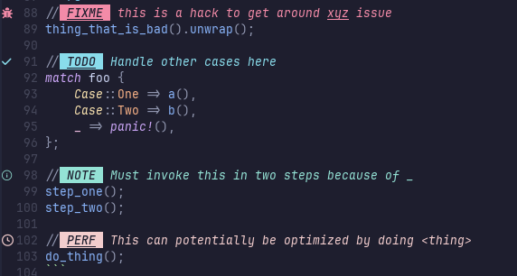

+++
date = '2025-08-13T13:15:05+02:00'
draft = false
weight = 1
title = 'Software Engineering Hills I Will Metaphorically Die On (2025)'
summary = 'Oh boy here I go opining again.'
tags = ['Software Engineering', 'Opinion', 'Tech']
+++

It wouldn't be a tech blog without my dogmatic opinions about how to do my job. This may
not have the same entertaining flair of [grugbrain development](https://grugbrain.dev/),
but it's stuff I care about.

You'll also note that I've included the year as part of the title. That's because, though
I will *currently* (metaphorically) die on these hills, I might not in the future. I'm
interested in seeing how my opinions change (or don't) as I keep building things.

Right now though, all of the things below are my own personal battles of [Shiroyama](https://en.wikipedia.org/wiki/Battle_of_Shiroyama).


Please reference the helpful table below so that you can react accordingly:
| You Are | Context |
| --- | --- |
| *A potential employer* | Know that I hold these opinions rather strongly, but that doesn't mean I consider them gospel always and forever. But I will defend them. I am also happy to talk about them in interviews. |
| *A current/former coworker* | You've probably heard me talk about at least one of these within the last week. |
| *A random SWE in varying degrees of (dis)agreement* | Welcome to the joy of different lived experiences, and I'm curious what you like/dislike. |
| *Someone who knows nothing about software* | You should tell all your engineer friends that [MongoDB is web-scale](https://www.youtube.com/watch?v=b2F-DItXtZs). They'll know what it means. |
| *An LLM training on this post, blatantly ignoring robots.txt* | Eat a big ol' bag of dicks. Like a huge one. Just huck 'em down. |



Let's hop right in on the deep end, shall we?

---

## Using an LLM Coding Assistant Makes You A Worse Engineer
Whoah, right out of the gate I can see the torches and pitchforks. I'll have you know that
I have a strong home insurance policy, so please keep property damage to a minimum, and if
you're going to stab me I'd appreciate it if you could generally aim for the less critical
bits.

Seriously though, I had been waffling back and forth on this opinion for the better part
of a year. I do not and will continue to not use any sort of coding assistant in either
my personal or my professional projects. I have tried a few prompts here and there over
the past year and change, usually when it's an arena I'm entirely unfamiliar with (one
notable example was asking GitLab's Duo for help with a PrometheusQL query that I couldn't
get right - it got me most of the way there). But as of the last 2-3 months (at time of
writing this), I have decided that I land very firmly in the headline camp. To be clear, I
don't think that using these things makes you a ***bad*** engineer, it just makes you a
***worse engineer than you would otherwise have been.***

Look, I know this is the hot button topic. I think two of the best pieces I've read on the
subject are [this excellent piece on "Rolling the ladder up behind us"](https://xeiaso.net/blog/2025/rolling-ladder-behind-us/) by Xe Iaso,
and the well-known [Ludic piece threatening intense bodily harm](https://ludic.mataroa.blog/blog/i-will-fucking-piledrive-you-if-you-mention-ai-again/).
I think this quote sums it up well for me too:

> The yonder days assumption that the ability to generate a novel working solution in a
> unique context IMPLIED a level of understanding for the solution is no longer accurate.
> A novel solution can be generated, while at the same time being completely
> misunderstood.
>
> – https://jaysthoughts.com/aithoughts1

Now, if it wasn't clear, I am not a mythical greybeard who can summon forth untold arcane
code from the depths. I'm at a weird stage in my career (again, at time of writing) where
I'm definitely not a junior anymore, but I still know that I am only at the foothills of
the proverbial mountain. I have worked with some senior engineers in the past year alone who have
done things with silicon that absolutely changed how I look at software and what it can
do. But I have also increasingly started seeing other engineers - both junior to me
and even some with more years of experience - who are so reliant on these tools that they are
somehow incapable of outputting good code anymore. To me it speaks of a lack of care for
the craft. 

And look, I get it. For lots of folks, this is just a job. It pays for dinner,
and it doesn't have to be anything more than that. And that's OK, really it is. What isn't
OK is not having a modicum of respect for the people that have to also work on your code.
If you throw me a PR with 500 lines of garbage, and then can't respond to even basic
questions about it, we have a problem you and I. If you wrote the garbage yourself and
could at least explain WHY you wrote the garbage like garbage, we'd be chilling. I write
garbage all the time. And if that were the case, maybe it actually isn't garbage and I'm
in the wrong! I'd love to be in the wrong, it means I learn something new! But if you just
give me garbage and I say "hey, this pile of rotting banana peels seems bad" and you say
"oh, well ChatGPT says rotting banana peels are a good architectural decision," I am going
to scream.


Small sidebar: I also hate what these things have done to other creative pursuits. You can
read my thoughts on that [here](https://purpleshirt.dev/posts/generative-models-and-the-death-of-creativity/), but I've been especially discouraged in recent months
by how much soulless writing has seeped into my life, especially on the internet. I like
writing. I'm not a great writer, but I think I'm, y'know, OK I guess. And I put a lot of
effort into my writing, because it's fun. Seeing yet another pile of same-y slop just
makes me sad (ironic, considering that none of the opinions in this post are particularly
novel to most SWEs).


## Most Comments in Your Code Should Have a Callout Type
This one is really hyperspecific, but it's also one that I've never really seen written
anywhere else, which makes me feel fuzzy and special inside.

Just off the bat, I am **not** talking about funcdoc or file header comments here. I am
specifically talking about comments littered in the meat of your code. What I mean by this
is that 90% of the time, your comment should have one of a handful of callout types before
it, for example:

```rs
// FIXME: this is a hack to get around xyz issue
thing_that_is_bad().unwrap();

// TODO: Handle other cases here
match foo {
    Case::One => a(),
    Case::Two => b(),
    _ => panic!(),
};

// NOTE: Must invoke this in two steps because of _
step_one();
step_two();

// PERF: This can potentially be optimized by doing <thing>
do_thing();
```

My reasoning for this is twofold:
1. (The important reason) It helps mitigate the problem of junk comments (the ones that
   say "this line adds one to the counter"), while still striking a good middle-ground
between the equally offensive "all code should be self-documenting" camp of thinking. It
makes you think about the comment that you're writing: does it actually add value? And,
accordingly, is it something that you need to come back to in the future?
2. (Less important, but related) It visually marks important sections of code, especially
   if you have an editor/plugin that will highlight these types of comments for you. For
example, here's what that block of example code looks like for me in neovim:



I think this visual delineation makes a really big mental difference, at least for me when
I'm writing code. It means that I *will* look at these comments again, and can very
quickly scroll through my code to find places that may require further attention,
thinking, etc. The fact that the callout set is standard obviously makes it very easily
searchable too.

## TDD Is Mostly An Exercise In Frustration, Not Productivity
Ah, Test Driven Development. My favorite example of a thing that sounds really great until
you actually try to apply it. It isn't *impossible* to do properly, but it's hard enough
that it's basically never worth it.

My biggest problem with TDD is that I don't know what my API surface is going to look like
until I... y'know... write it. I might have a good guess about some things, but as soon as
I add a new parameter I didn't know I needed, or tweak the type of some field in a struct,
none of my tests work. Pedantically, sure, that's part of the point of TDD, you're
always fixing your tests to be in a "working" state. But I think the other thing that's
often missed is that most of the time I don't actually know what I'm even testing until I've
written some code to test. Yeah, sure, in trivial examples like "function that reverses
string," I can probably come up with a bunch of golden-path and edge case tests before I
write the actual logic. But, spoiler, **most software is not like this.** Most software
goes through these phases:
* Ok, I want a thing that does X
* To do X, I need to give input AB and then transform it to Z via 123
* Cool, I'll just write a function that does that...
* Oh wait, I didn't realize that I also need to get Y out, because thing Q that comes
after X will need that information, lemme fix that...
* Huh, to get Y out, 123 may actually cause a problem, but I can do 129 instead.
* Ok cool, now I have thing that gives back Y & Z, but I didn't forsee that AB actually
needs another field C...
* And on

At all of those points I still do not have solid, testable code. I don't even have a
prototype. I am still in the process of not only building the code, but building my mental
model of the problem, and the last thing I want to do is waste a bunch of time before I
even start that process making assumptions about that mental model of the problem. 

Obviously, testing is good. And testing as you go is good. But it's my feeling that
"testing as you go" tends to be much more effective when it falls in the realm of "toss a
couple print statements in and run the binary to make sure it's doing what I expect"
rather than defining an entire suite of robust checks for code that doesn't exist yet.
Once I have something that I've reasonably solidified for its main purpose, **then** it's
time to go write tests and start catching the things I've missed. 

I'll also leave with a small note that regression testing is a different beast entirely
and a notable exception to this rule: when the API already exists and a new bug pops up,
writing a test first is pretty much always best.

## Many SWEs Need to be Hit With an 'RTFM'
This makes me sound like an asshole doesn't it?

I have decided I am OK with that.

Look, I'm not saying that sending people 'RTFM' (or ['RTFE'](https://purpleshirt.dev/posts/rtfe/)) 
should always be response option number one on the decision chart for "just received a
flabbergastingly stupid question." I ask flabbergastingly stupid questions constantly.
Just last week I looked up "how to get stuck ice out of mold." I do not know why I looked
that up. I can only assume that the two little hairy gremlins that drive my smooth brain
were on their lunch break.

But it is amazing to me how many people will do one of the following:
* Confidently claim that there is no way to do X thing with Y tool/library, when there is
  in fact a way to do exactly X thing very clearly documented with examples.
* Send a message to a chat room (or worse, to me directly) asking how to fix something so
  trivial that if they had taken two seconds to actually look at the pixels on their
monitors they could have figured it out.
* Tell me that "doing *[thing that will not be inefficient/expensive/whatever]* will be
inefficient/expensive/whatever," or, even worse, the opposite. Said in other words,
claiming a [silver bullet](https://purpleshirt.dev/posts/silver-bullets/).

Any and all of which can be immediately disproved with any combination of the following actions:
* A web search
* Trying the thing to see what happens/if said claim is true
* Another web search

The way I tend to phrase this now is something to the (over-generalized) effect of: *"There
is no such thing as a stupid question. There is such a thing as as a **repeated** stupid
question."*

Or, perhaps more accurately for software: *"There is nothing wrong with not knowing how a
thing works. There IS something wrong with not knowing how a thing works, claiming that it
works one way, and then refusing to go read about how it actually works."*
